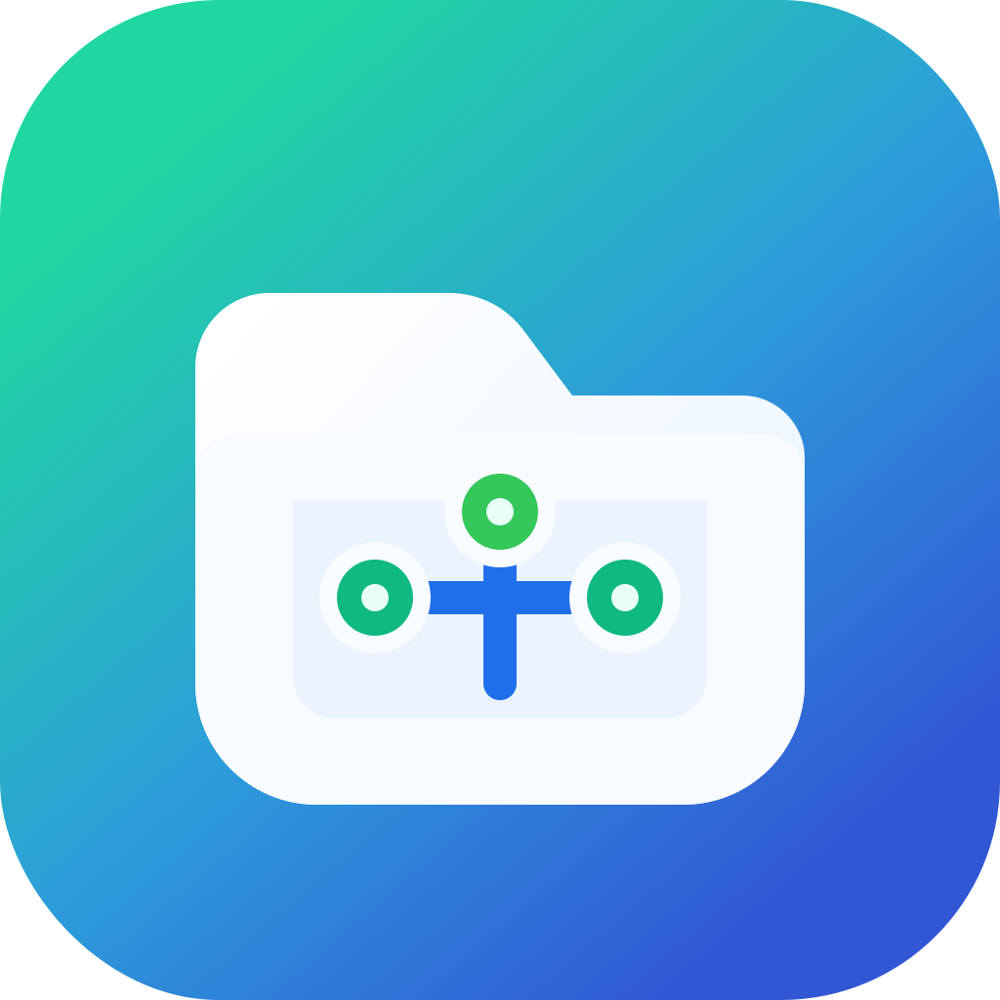

# EasyLocalDav

<p align="center">
  
</p>

<p align="center">
  <strong>Turn a local macOS folder into a local WebDAV server for Zotero.</strong>
</p>

<p align="center">
  <a href=".github/workflows/release.yml"></a>
  
  
  
</p>

EasyLocalDav is a lightweight macOS menu bar app that serves local folders as WebDAV endpoints using [`rclone serve webdav`](https://rclone.org/commands/rclone_serve_webdav/). It is built for Zotero users who want a simple local WebDAV target without running a full server stack.

The app stays out of the Dock, lives in the menu bar, and can restore enabled WebDAV services automatically when it launches.

## Features

- Menu bar only, with no Dock icon.
- Manage multiple local WebDAV services.
- Select a local folder, bind host, and port per service.
- Default WebDAV credentials:
  - Username: `easylocaldav`
  - Password: `easylocaldav`
- Bind to `127.0.0.1` for local-only Zotero use.
- Optional `0.0.0.0` binding for trusted LAN access.
- Bundled `rclone` in release builds, with Homebrew/system fallback during development.
- Launch at login support on macOS 13 and newer.
- Daily GitHub Release update checks with a one-click link to the latest release.
- GitHub Actions workflow for Apple Silicon DMG releases.

## Quick Start

1. Download the latest `EasyLocalDav-arm64.dmg` from GitHub Releases.
2. Open the DMG and drag `EasyLocalDav.app` onto the `Applications` alias.
3. Open the app. It appears in the macOS menu bar.
4. Add a service.
5. Choose a local folder.
6. Set host to `127.0.0.1`.
7. Choose an unused port, such as `8080`.
8. Start the service and copy the WebDAV URL.

Because current releases are unsigned and not notarized, macOS may block the first launch. Open it from Finder with right click -> Open, then confirm the security prompt.

## Zotero Setup

In Zotero, use the WebDAV URL shown by EasyLocalDav.

Example:

```text
URL:      http://127.0.0.1:8080/
Username: easylocaldav
Password: easylocaldav
```

Use `127.0.0.1` unless you specifically need another device on your local network to access the folder.

## Development

Requirements:

- macOS 13 or newer
- Xcode command line tools
- Swift toolchain
- `rclone` for local development fallback

Build the app bundle:

```sh
./Scripts/package_app.sh
```

Create a drag-to-Applications DMG:

```sh
./Scripts/create_dmg.sh
```

Run the packaged app:

```sh
open dist/EasyLocalDav.app
```

Run a debug build:

```sh
swift build -c debug
```

## Release

The release workflow builds an Apple Silicon macOS app, downloads the official `rclone` darwin arm64 binary, embeds it into the app bundle, creates a DMG, and uploads it to a GitHub Release.

Release builds are:

- Apple Silicon only
- macOS 13+
- Unsigned
- Not notarized

To publish, push a version tag:

```sh
git tag v0.1.0
git push origin v0.1.0
```

## Security Notes

EasyLocalDav is designed for local Zotero use. Prefer `127.0.0.1` binding for day-to-day usage.

Binding to `0.0.0.0` may expose the WebDAV server to your local network. Use it only on trusted networks and change the default password if needed.

## Third-Party Notices

EasyLocalDav uses `rclone` as its WebDAV backend. Interface SVG icons are based on Tabler Icons under the MIT license. See [Resources/ThirdPartyNotices.md](Resources/ThirdPartyNotices.md).

## License

MIT. See [LICENSE](LICENSE).
